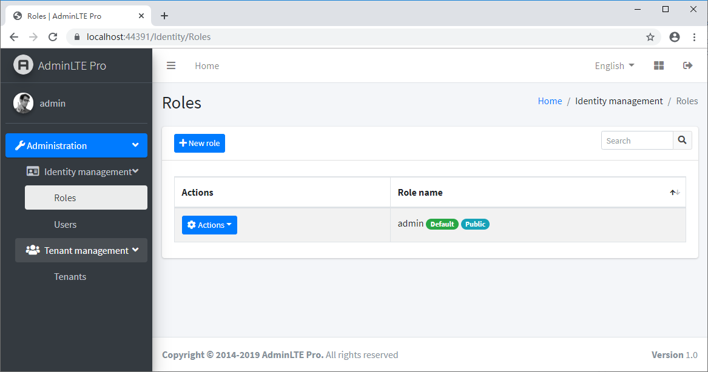

# Abp.AspNetCore.Mvc.UI.Theme.AdminLTE

An [ABP](http://abp.io) theme module based on [AdminLTE](https://adminlte.io/)



Although this module is in development stage, it works. You can see the sample project in the `src` folder.

# How to use

1. Install nuget packages
    
    * Web project:

        `Install-Package Abp.AspNetCore.Mvc.UI.Theme.AdminLTE`

1. Replace theme module depends

    * Web project:

        ``` csharp
        ...
        [DependsOn(
            ...
            // typeof(AbpAspNetCoreMvcUiBasicThemeModule),
            typeof(AbpAspNetCoreMvcUiAdminLTEThemeModule),
            ...
        ]
        public class YourWebModule : AbpModule
        {
            ...
        }
        ```

1. Enjoy
